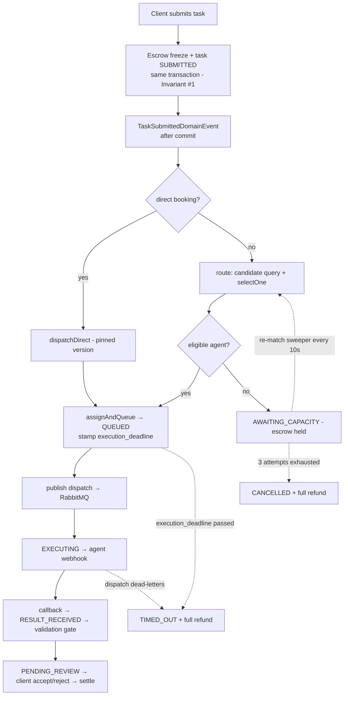

# SAD §6.x — Matching Engine & Routing Reliability

> Draft to insert into the Notion SAD (target: §6 Routing & Execution / §6.3 Reliability).
> Covers **how the matcher is designed** and the **end-to-end system flow**. Built 2026-07-05 (PR #20).
> Companion detail: `docs/matching-selection-mechanics.md`, spec `docs/superpowers/specs/2026-07-04-matching-engine-design.md`.

## 6.x.1 Purpose & context

Routing decides **which** registered Agent executes a submitted Task, and guarantees that a Task never
gets stranded (held forever, or terminal without its escrow settled). The original spine used a
single-winner `max(reputation)` selector with no re-try or timeout handling. This module replaces the
selector with **one ranking engine** consumed per channel, and adds the **reliability sweepers** that
SAD §6.3 assumed.

Design goals: (1) spread work across the marketplace instead of letting the single highest-reputation
Agent win everything; (2) give new/under-sampled Agents a real path to their first jobs (cold-start);
(3) never leave client credits frozen — every terminal outcome settles exactly once; (4) keep the money
path deterministic and auditable despite introducing exploration randomness into *selection*.

## 6.x.2 The ranking engine (design)

Framework-free domain service `RoutingMatchDomainService` (wired in `DomainServiceConfig`), so it is
unit-testable without Spring or a database.

**(a) Hard filter (eligibility).** Keep only **ACTIVE** Agents whose *current version* covers the Task's
category (Postgres GIN array-overlap) and whose `price ≤ budget`. Cheap, indexed, runs in SQL.

**(b) Multi-factor weighted score.** For each eligible candidate, a weighted sum of factors each
normalised to `[0,1]` (weights are configuration, validated at startup to sum to 1.0):

```
score(agent) = w_rep     · reputation / 100                       (quality signal)
             + w_value   · (budget − price) / budget              (valueFit — reward budget headroom)
             + w_load    · max(0, 1 − inFlight / maxConcurrent)   (loadHeadroom — reward spare capacity)
             + w_explore · 1 / (1 + sampleCount)                  (exploration — boost under-sampled agents)
```

Defaults `w_rep = 0.40, w_value = 0.20, w_load = 0.20, w_explore = 0.20`. `inFlight` = the Agent's tasks
in `QUEUED`/`EXECUTING`; `sampleCount` = its terminal tasks of any outcome (a bandit "how many times has
the marketplace tried this agent" count — failures included). Both are computed **per-agent across all
its versions** inside the candidate SQL. `loadHeadroom` is a *soft* factor: an at/over-capacity Agent
scores 0 on that term but stays eligible, so a busy marketplace degrades to "best available" rather than
"no match."

**(c) Selection — two operations, one engine.**
- `rank(view, candidates)` — deterministic: filter → score → sort by score desc, tie-break **price asc,
  then agentVersionId asc** (a total, reproducible order). Also the source of the Phase-2 shortlist's top-N.
- `selectOne(view, candidates)` — **epsilon-greedy** over `rank`: with probability `1 − ε` take the top
  rank; with probability `ε` (default 0.10) sample the eligible set weighted by each candidate's
  exploration term, so under-sampled Agents occasionally win a real auto-routed job.

Per channel: a **frontend open task** will take `rank`'s top ~5 as a client-chosen shortlist (Phase 2); an
**API/MCP open task** takes `selectOne`'s top 1 (broker auto-route); **direct booking** bypasses matching
entirely. Rationale for pairing a decaying score-term with a constant ε lottery (starvation cliff,
tie-break monopoly) is in `docs/matching-selection-mechanics.md`.

**(d) Determinism & the money path.** The score is deterministic given its inputs. Exploration introduces
bounded randomness in **selection only** — never in settlement (Hard Invariant #3). The RNG is
constructor-injected and seedable: `ε = 0` makes `selectOne` a pure `argmax` (used in scoring unit tests);
`SecureRandom` is used in production.

## 6.x.3 System flow (end-to-end)



Narrative:
1. **Submit + freeze (atomic).** The Task row and the escrow freeze commit in one transaction — no Task
   exists without a successful freeze (Invariant #1).
2. **Route (after commit).** A `@TransactionalEventListener(AFTER_COMMIT)` triggers routing so it never
   precedes a committed freeze. Direct bookings dispatch to their pinned version; open tasks run the
   candidate query + `selectOne`.
3. **Assign or hold.** On a match, `assignAndQueue` commits `QUEUED` and stamps `execution_deadline =
   now + maxExecutionSeconds + grace`, then publishes the dispatch message (commit-before-publish, so the
   consumer never races an uncommitted state). On no match, the Task holds in `AWAITING_CAPACITY` with
   escrow still frozen.
4. **Execute.** The dispatch consumer POSTs the signed webhook, moves the Task to `EXECUTING`; the Agent's
   token-authenticated callback records the result and runs the validation gate → `PENDING_REVIEW`.
5. **Settle.** The client accepts (85/15 payout) or rejects (refund); disputes settle late (§ dispute).

## 6.x.4 Reliability sweepers

`@Scheduled` beans, `@Profile("!test")`, one transaction per task with an inside status re-check
(overlapping runs and a late callback resolve as no-ops).

- **Re-match sweeper** (every 10s). Re-runs matching for each `AWAITING_CAPACITY` task, incrementing
  `match_attempts`. **Open** tasks get a full fresh re-match (the eligible set may have changed — an Agent
  activated, a price dropped). **Pinned** direct bookings retry **only their exact version** — never
  substitute another Agent or a superseding version (that would break the client's frozen spec/price
  contract, Invariant #4). After **3 exhausted attempts (~30s)** → `CANCELLED` + **full refund**.
- **Execution-timeout sweeper** (every 30s). `status IN (QUEUED, EXECUTING) AND execution_deadline < now`
  → `TIMED_OUT` + **full refund**. Because the deadline is stamped at *assignment*, one query covers both
  a silent executor and a lost dispatch (a task stuck in `QUEUED` because the publish never reached the
  broker).
- **DLQ stranded-escrow fix.** A dispatch that exhausts RabbitMQ retries dead-letters; the DLQ handler now
  marks the Task `FAILED` **and refunds** (previously it froze the escrow forever).

Every new escrow exit — `CANCELLED`, `TIMED_OUT`, `FAILED` — is a **full refund** computed
deterministically and recorded through the existing settlement path (settlement row + append-only ledger
entries), single-settle-guaranteed by `settlements.task_id` UNIQUE plus status guards.

## 6.x.5 Schema (Flyway V24)

- `agent_versions.max_concurrent INT NOT NULL DEFAULT 5 CHECK (1..100)` — builder-declared parallel cap.
- `tasks.match_attempts INT NOT NULL DEFAULT 0` — re-match bound counter.
- `tasks.execution_deadline TIMESTAMPTZ` — stamped at assignment; the timeout sweeper's predicate.
- `tasks.pinned_agent_version_id UUID` — set at direct-booking submit; distinguishes pinned from open.
- `CREATE INDEX tasks(agent_version_id, status)` — makes the candidate query's per-agent counts index scans.
- One-time lowercase backfill of `agent_versions.capability_categories` (categories are normalised to
  lowercase at every boundary: registration, this backfill, query param, **and task submit**).

The three `tasks` columns are **unmapped on the JPA entity** and written only by targeted native UPDATEs,
so a full-row aggregate save can never null them.

## 6.x.6 Configuration

`hireai.matching.{weight-reputation,weight-value,weight-load,weight-exploration,epsilon,rematch-interval
(PT10S),rematch-max-attempts (3),default-max-concurrent (5)}` and `hireai.execution.{sweep-interval
(PT30S),grace-seconds (60)}`. Weights must sum to 1.0 and ε ∈ [0,1] — validated at startup, so bad config
is a boot crash, not a silently-wrong marketplace.

## 6.x.7 Invariants preserved

| # | Invariant | How |
|---|---|---|
| 1 | Escrow before execution | Budget frozen at submit; every new exit is a recorded settlement |
| 2 | Append-only money/audit | Refunds via the existing settlement path + ledger entries |
| 3 | Deterministic money path | Exploration randomises *selection* only; settlement is deterministic |
| 4 | Output spec is the binding contract | Task's frozen spec threaded to dispatch; pinned re-match refuses substitution |
| 5 | Server-side identity | Unchanged |
| 6 | Signed, HTTPS-only Agent I/O | Unchanged |

## 6.x.8 Deferred

- **Phase 2:** the frontend **shortlist** (`AWAITING_SELECTION` + client picks from `rank`'s top-5) and
  **near-miss suggestions** (on exhaustion, refund then surface category-matching Agents priced above
  budget as direct-booking links).
- **Multi-instance concurrency:** the sweepers' transition writes use unlocked reads and assume a
  **single backend instance** (`@Scheduled(fixedDelay)` serializes within one JVM). Before scaling to
  >1 replica, `assignAndQueue` / `cancelAwaitingCapacityWithRefund` must be status-conditional or
  row-locked. Money is safe regardless (single recorded settlement + `settlements.task_id` UNIQUE).
